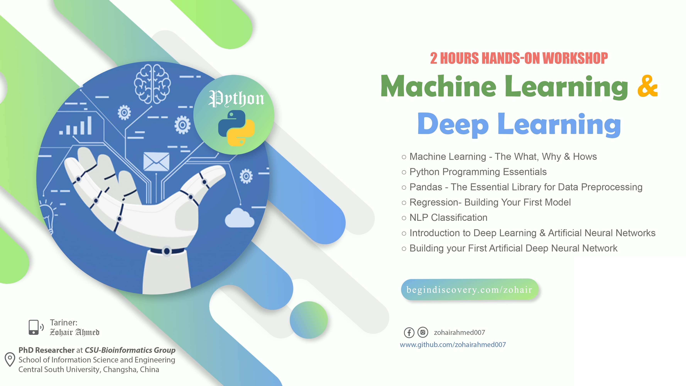

# Hands-On Workshop
## _Machine Learning & Deep Learning_

Machine Learning with Python course dives into the basics of machine learning using Python, an approachable and well-known programming language. You'll learn about supervised vs. unsupervised learning, look into how statistical modeling relates to machine learning, and do a comparison of each.  We'll explore many popular algorithms including Classification, Regression, Clustering, and Dimensional Reduction and popular models such as Train/Test Split, Root Mean Squared Error (RMSE), and Random Forests. 

- Machine Learning - The What, Why & Hows 
- Python Programming Essentials
- Pandas - The Essential Library for Data Preprocessing
- Regression- Building Your First Model
- NLP Classification 
- Introduction to Artificial Neural Networks
- Building your First Artificial Neural Network

## About Me

> Ph.D. Scholar in Computer Science in Changsha, China. I have done it Masters/MPhil and Bachelor in Computer 
> Science. My Research field is NLP, Data Mining, Machine Learning. I have more than 5 Years of Professional Experience in 
> Web Design & Development (HTML, CSS, Bootstrap, Asp Net, Word press). Also, I'm a specialist in Video Editing and Graphic Design.

<h2> Connect with me  </h2>
  

  
<a href="https://begindiscovery.com/zohair" target="_blank"  style="margin-bottom: 5px;">Click to Visit Personal website</a> 

  

   
